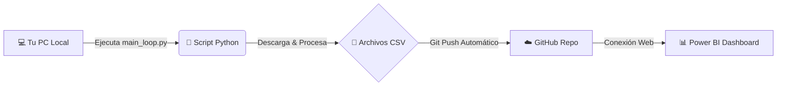

# 🚀 Finance Data Hub
### Ecosistema de Automatización e Inteligencia Financiera


**Finance Data Hub** es una solución integral que combina la potencia de **Python** para la extracción de datos en tiempo real con la capacidad de visualización de **Power BI**. El sistema automatiza el ciclo de vida del dato: desde su captura en mercados financieros hasta su presentación en dashboards ejecutivos de alto impacto.

### Dashboard


---

## 🧩 Módulos del Sistema

El proyecto se divide en tres pilares fundamentales para una gestión 360°:

| Módulo | Descripción | Fuente de Datos |
| :--- | :--- | :--- |
| 📈 **Mercado** | Descarga precios, volumen y volatilidad de activos (AAPL, MSFT, BTC, ETH). | **Yahoo Finance API** |
| 💰 **Finanzas** | Registro y control de flujos de caja, ingresos y gastos operativos. | *Simulado (Demo)* |
| 📦 **Inventario** | Control de stock, rotación y valoración de almacén en tiempo real. | *Simulado (Demo)* |

---

## ⚙️ Arquitectura y Flujo de Trabajo

El sistema funciona bajo un esquema de **Sincronización Continua (CI/CD for Data)**:



1.  **Ejecución Local:** El script `main_loop.py` actúa como un "bot" residente en tu equipo.
2.  **Procesamiento:** Genera archivos CSV optimizados en la carpeta `data/`.
3.  **Sincronización Cloud:** Detecta cambios y realiza un `git push` automático al repositorio.
4.  **Consumo:** Power BI se conecta a los archivos "Raw" de GitHub, permitiendo actualizar el reporte desde cualquier lugar sin acceso a la PC local.

---

## 🚀 Guía de Instalación y Uso

Sigue estos pasos para desplegar el "bot" de datos en tu máquina:

### 1. Preparar el Entorno
Abre tu terminal en la carpeta del proyecto y ejecuta:

```bash
# Crear entorno virtual (Recomendado)
python -m venv venv

# Activar entorno (Windows)
.\venv\Scripts\Activate

# Instalar dependencias del proyecto
pip install -r requirements.txt
```

### 2. Ejecutar el Bot
Una vez instalado, inicia el motor de datos. Este comando se quedará esperando y actualizando cada 5 minutos.

```bash
python main_loop.py
```

> **Nota:** Verás logs indicando "Iniciando escaneo...", "Procesado OK" y "GIT: Push completado".


### Terminal ejectando el Bot


---

## 📊 Visualización en Power BI

Para conectar Power BI y configurar los visuales avanzados (HTML/CSS), hemos preparado un manual técnico detallado.

👉 **[Leer Manual de Implementación Power BI (DAX + HTML)](MANUAL_TUTORIAL_POWERBI_V2.md)**

---

## 📂 Estructura del Proyecto

```text
FinanceDataHub/
├── data/                   # 📂 Almacén de datos (CSVs generados)
├── src/                    # 🧠 Código fuente (Lógica de negocio)
│   └── market_analytics.py #    Motor de análisis financiero
├── venv/                   # 🐍 Entorno virtual Python
├── dashboard_app.py        # 🖥️ App de escritorio (Tkinter)
├── main_loop.py            # 🔄 Script principal (Bot de automatización)
├── METRICAS_Y_MEDIDAS.md   # 📝 Guía rápida de métricas
├── MANUAL_TUTORIAL...md    # 📘 Manual completo Power BI
└── requirements.txt        # 📦 Lista de dependencias
```

---
*Desarrollado por **Juancito Peña** | Enero 2026*
