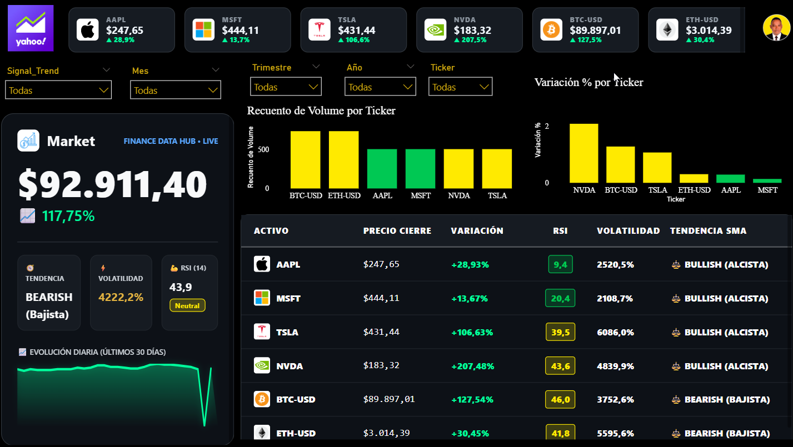
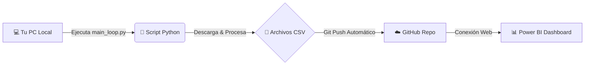
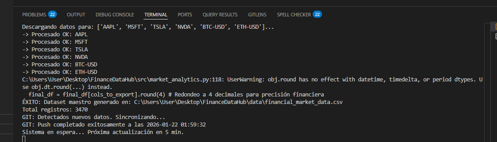

# 🚀 Finance Data Hub
### Ecosistema de Automatización e Inteligencia Financiera


**Finance Data Hub** es una solución integral que combina la potencia de **Python** para la extracción de datos en tiempo real con la capacidad de visualización de **Power BI**. El sistema automatiza el ciclo de vida del dato: desde su captura en mercados financieros hasta su presentación en dashboards ejecutivos de alto impacto.

### Dashboard




---

## 🧩 Módulos del Sistema

El proyecto se divide en tres pilares fundamentales para una gestión 360°:

| Módulo | Descripción | Fuente de Datos |
| :--- | :--- | :--- |
| 📈 **Mercado** | Descarga precios, volumen y volatilidad de activos (AAPL, MSFT, BTC, ETH). | **Yahoo Finance API** |
| 💰 **Finanzas** | Registro y control de flujos de caja, ingresos y gastos operativos. | *Simulado (Demo)* |
| 📦 **Inventario** | Control de stock, rotación y valoración de almacén en tiempo real. | *Simulado (Demo)* |

---

## ⚙️ Arquitectura y Flujo de Trabajo

El sistema funciona bajo un esquema de **Sincronización Continua (CI/CD for Data)**:



1.  **Ejecución Local:** El script `main_loop.py` actúa como un "bot" residente en tu equipo.
2.  **Procesamiento:** Genera archivos CSV optimizados en la carpeta `data/`.
3.  **Sincronización Cloud:** Detecta cambios y realiza un `git push` automático al repositorio.
4.  **Consumo:** Power BI se conecta a los archivos "Raw" de GitHub, permitiendo actualizar el reporte desde cualquier lugar sin acceso a la PC local.

---
### Dashboard


## 🚀 Guía de Instalación y Uso

Sigue estos pasos para desplegar el "bot" de datos en tu máquina:

### 1. Preparar el Entorno
Abre tu terminal en la carpeta del proyecto y ejecuta:

```bash
# Crear entorno virtual (Recomendado)
python -m venv venv

# Activar entorno (Windows)
.\venv\Scripts\Activate

# Instalar dependencias del proyecto
pip install -r requirements.txt
```

### 2. Ejecutar el Bot
Una vez instalado, inicia el motor de datos. Este comando se quedará esperando y actualizando cada 5 minutos.

```bash
python main_loop.py
```

> **Nota:** Verás logs indicando "Iniciando escaneo...", "Procesado OK" y "GIT: Push completado".


### Terminal ejectando el Bot


---

## 📊 Visualización en Power BI

Para conectar Power BI y configurar los visuales avanzados (HTML/CSS), hemos preparado un manual técnico detallado.

👉 **[Leer Manual de Implementación Power BI (DAX + HTML)](MANUAL_TUTORIAL_POWERBI_V2.md)**

---

## 📂 Estructura del Proyecto

```text
FinanceDataHub/
├── data/                   # 📂 Almacén de datos (CSVs generados)
├── src/                    # 🧠 Código fuente (Lógica de negocio)
│   └── market_analytics.py #    Motor de análisis financiero
├── venv/                   # 🐍 Entorno virtual Python
├── dashboard_app.py        # 🖥️ App de escritorio (Tkinter)
├── main_loop.py            # 🔄 Script principal (Bot de automatización)
├── METRICAS_Y_MEDIDAS.md   # 📝 Guía rápida de métricas
├── MANUAL_TUTORIAL...md    # 📘 Manual completo Power BI
└── requirements.txt        # 📦 Lista de dependencias
```

# 📘 Manual de Implementación Técnica: Power BI & FinanceDataHub

**Versión:** 6.0 (FINAL COMPLETA - Enero 2026)  
**Desarrollador:** Juancito Peña  
**Tecnologías:** Power BI • DAX • HTML/CSS (Visual HTML Content) • Python • SVG


---

## 🌟 1. Introducción y Contexto

### 🛑 Planteamiento del Problema
Los reportes financieros tradicionales en Power BI sufren de dos grandes limitaciones:
1.  **Estética Rígida:** Las tablas nativas son visualmente pobres y los gráficos estándar no permiten personalización avanzada (micro-charts, gradientes, layouts web).
2.  **Datos Estáticos:** Dependen de alguien que presione "Actualizar" manualmente.

### ✅ Solución: Finance Data Hub
Hemos implementado una arquitectura híbrida que combina la potencia de cálculo de Python con la flexibilidad de visualización de la web (HTML5) dentro de Power BI.

*   **Backend (Python):** Script `main_loop.py` que descarga datos de Yahoo Finance y sincroniza con GitHub cada 5 minutos.
*   **Frontend (Power BI + HTML):** Uso del visual `HTML Content` para renderizar tarjetas, tablas y gráficos SVG definidos dinámicamente con DAX.

### 🔗 Dashboard en Vivo
👉 **[Ver Dashboard Power BI Online](https://app.powerbi.com/view?r=eyJrIjoiNmNhNTg3MzctMTkzMC00Mjk5LTk3NTctYTQxNjFjNTg4ZTRmIiwidCI6IjMwOTE4NjllLTFiNWMtNDlhNy1iZWQwLTA1ODJiMjBlYzg0NSIsImMiOjJ9)**

---

## 🛠️ 2. Modelado de Datos (Tablas Calculadas)

Antes de las medidas, necesitamos estructuras auxiliares para soportar la lógica del negocio.

### A. Tabla de Riesgo (Segmentación)
*   **Propósito:** Crear una dimensión desconectada para segmentar los activos por su nivel de volatilidad (Bajo, Medio, Alto) sin filtrar los datos transaccionales.
*   **Creación:** Pestaña *Modelado* > *Nueva Tabla*.

```dax
Tab_Riesgo = DATATABLE(
    "Nivel", STRING, "Orden", INTEGER, "Min", DOUBLE, "Max", DOUBLE,
    {
        {"Bajo Riesgo", 1, 0.00, 0.25},
        {"Riesgo Medio", 2, 0.25, 0.45},
        {"Riesgo Alto", 3, 0.45, 10.00}
    }
)
```

### B. Tabla de Actualización (Power Query)
*   **Propósito:** Capturar la "Fuente de Verdad" del tiempo. Registra el momento exacto en que Power BI procesó los datos.
*   **Creación:** 
    1. *Transformar datos* > *Nueva fuente* > *Consulta en blanco*.
    2. Barra de fórmulas: `= #table(type table[UltimaCarga=datetime], {{DateTime.LocalNow()}})`
    3. Renombrar consulta a: `Refresh_Log`.

---

## 🧠 3. Medidas DAX Fundamentales (El Motor)

Estas medidas calculan los KPIs numéricos que alimentan los visuales.

### 💰 1. Precio Actual
*   **Definición:** El precio de cierre del último día disponible en el contexto actual.
*   **Uso:** Valor principal en tarjetas y tablas.
*   **Fórmula:**
```dax
Precio Actual = 
VAR _UltimaFecha = LASTDATE('financial_market_data'[Date])
RETURN
CALCULATE(SUM('financial_market_data'[Close]), _UltimaFecha)
```

### 📉 2. Variación Porcentual
*   **Definición:** El rendimiento del activo en el periodo seleccionado.
*   **Uso:** Determina si el activo está en "Verde" (Positivo) o "Rojo" (Negativo).
*   **Fórmula:**
```dax
Variación % = 
VAR PrecioInicio = CALCULATE(SUM('financial_market_data'[Close]), FIRSTDATE('financial_market_data'[Date]))
VAR PrecioFin = [Precio Actual]
RETURN
DIVIDE(PrecioFin - PrecioInicio, PrecioInicio)
```

### 📊 3. RSI Actual (Indicador Técnico)
*   **Definición:** Índice de Fuerza Relativa promedio a la fecha actual.
*   **Uso:** Medir si el activo está "caro" (Sobrecompra) o "barato" (Sobreventa).
*   **Fórmula:**
```dax
RSI Actual = 
VAR _UltimaFecha = LASTDATE('financial_market_data'[Date])
RETURN
CALCULATE(AVERAGE('financial_market_data'[RSI_14]), _UltimaFecha)
```

### 🚦 4. Estado RSI (Semáforo)
*   **Definición:** Traducción textual del valor RSI.
*   **Lógica:** >70 = Sobrecompra, <30 = Sobreventa, Resto = Neutral.
*   **Fórmula:**
```dax
Estado RSI = 
VAR _RSI = [RSI Actual]
RETURN
SWITCH(TRUE(),
    ISBLANK(_RSI), "N/A",
    _RSI >= 70, "Sobrecompra",
    _RSI <= 30, "Sobreventa",
    "Neutral"
)
```

### 🎨 5. Color RSI (Hexadecimal)
*   **Definición:** Asigna un código de color web según el estado del RSI.
*   **Uso:** Inyectar estilos CSS dinámicos.
*   **Fórmula:**
```dax
Color RSI = 
VAR _RSI = [RSI Actual]
RETURN
SWITCH(TRUE(),
    _RSI >= 70, "#ff1744", // Rojo (Venta)
    _RSI <= 30, "#00c853", // Verde (Compra)
    "#ffea00"              // Amarillo (Neutral)
)
```

### ⚡ 6. Volatilidad Promedio
*   **Definición:** Promedio de la volatilidad anualizada calculada en Python.
*   **Uso:** Clasificar el riesgo del activo.
*   **Fórmula:**
```dax
Volatilidad Promedio = AVERAGE('financial_market_data'[Volatility_Annualized])
```

### 🧭 7. Tendencia SMA
*   **Definición:** Dirección de la tendencia basada en el cruce de medias móviles (Golden/Death Cross).
*   **Uso:** Mostrar "Bullish" (Alcista) o "Bearish" (Bajista).
*   **Fórmula:**
```dax
Tendencia SMA = 
VAR _UltimaFecha = LASTDATE('financial_market_data'[Date])
RETURN
CALCULATE(MAX('financial_market_data'[Signal_Trend]), _UltimaFecha)
```

### 🔍 8. Filtro de Riesgo
*   **Definición:** Medida lógica para filtrar visuales según la selección en `Tab_Riesgo`.
*   **Fórmula:**
```dax
Filtro_Nivel_Riesgo = 
VAR _Vol = [Volatilidad Promedio]
VAR _Min = MIN(Tab_Riesgo[Min])
VAR _Max = MAX(Tab_Riesgo[Max])
RETURN
IF(_Vol >= _Min && _Vol < _Max, 1, 0)
```

---

## ✨ 4. Visualizaciones Avanzadas (HTML/CSS/SVG)

A continuación, los códigos completos de los visuales de alto impacto. Arrastra el visual **HTML Content** y asigna estas medidas.

### 🟦 Visual 1: Barra Superior (Ticker Tape)
*   **Descripción:** Una cinta horizontal con scroll que muestra el resumen de todos los activos.
*   **Tecnología:** Flexbox CSS para alineación, Logos externos.
*   **Fórmula:**
```dax
HTML_TopBar_Cards1 = 
VAR _Filas =
    CONCATENATEX(
        FILTER(VALUES('financial_market_data'[Ticker]), NOT(ISBLANK('financial_market_data'[Ticker])) && [Precio Actual] > 0),
        VAR _Ticker = 'financial_market_data'[Ticker]
        VAR _Var = [Variación %]
        VAR _Precio = [Precio Actual]
        VAR _Color = IF(_Var >= 0, "#00ff9d", "#ff3d5d")
        VAR _Icono = IF(_Var >= 0, "▲", "▼")
        VAR _Logo = SWITCH(_Ticker,
            "AAPL", "https://upload.wikimedia.org/wikipedia/commons/f/fa/Apple_logo_black.svg",
            "MSFT", "https://trendlyne-media-mumbai-new.s3.amazonaws.com/profilepicture/1554053_profilepicture.png",
            "TSLA", "https://upload.wikimedia.org/wikipedia/commons/thumb/e/e8/Tesla_logo.png/500px-Tesla_logo.png",
            "NVDA", "https://companieslogo.com/img/orig/NVDA-220e1e03.png?t=1722952498",
            "BTC-USD", "https://www.criptonoticias.com/wp-content/uploads/2023/10/BC_Logo_.png",
            "ETH-USD", "https://logokit.com/icons/ETH.png",
            "https://cdn-icons-png.flaticon.com/256/5588/5588146.png"
        )
        RETURN
        "<div class='mini-card'>
            
            <div class='info'>
                <div class='ticker'>" & _Ticker & "</div>
                <div class='price'>$" & FORMAT(_Precio, "#,##0.00") & "</div>
                <div class='change' style='color: " & _Color & ";'>" & _Icono & " " & FORMAT(ABS(_Var), "0.0%") & "</div>
            </div>
        </div>", ""
    )
RETURN
"<style>
    .top-bar { display: flex; gap: 15px; overflow-x: auto; padding: 10px; font-family: 'Segoe UI', sans-serif; }
    .mini-card { min-width: 170px; background: #161b22; border: 1px solid #30363d; border-radius: 12px; padding: 12px; display: flex; align-items: center; gap: 12px; box-shadow: 0 4px 6px rgba(0,0,0,0.3); }
    .mini-logo { width: 35px; height: 35px; object-fit: contain; background: white; border-radius: 6px; padding: 4px; }
    .info { display: flex; flex-direction: column; line-height: 1.2; }
    .ticker { font-size: 11px; font-weight: 800; color: #8b949e; text-transform: uppercase; }
    .price { font-size: 16px; font-weight: bold; color: #f0f6fc; }
    .change { font-size: 11px; font-weight: 900; }
    .top-bar::-webkit-scrollbar { display: none; }
</style>
<div class='top-bar'>" & _Filas & "</div>"
```

### 📋 Visual 2: Tabla Ejecutiva v3 (Clean)
*   **Descripción:** Listado detallado de activos con badges de colores para RSI y emojis para tendencia.
*   **Tecnología:** CSS Grid, HTML Divs, Lógica condicional DAX para estilos.
*   **Fórmula:**
```dax
HTML_Table_Executive_Clean_v3 = 
VAR _Filas = 
    CONCATENATEX(
        FILTER(
            VALUES('financial_market_data'[Ticker]), 
            NOT(ISBLANK('financial_market_data'[Ticker])) && [Precio Actual] > 0
        ),
        VAR _Ticker = 'financial_market_data'[Ticker]
        VAR _Precio = [Precio Actual]
        VAR _Var = [Variación %]
        VAR _RSI = [RSI Actual]
        VAR _Vol = [Volatilidad Promedio]
        VAR _Trend = [Tendencia SMA]
        
        // --- LÓGICA DE COLORES Y EMOJI ÚNICO ---
        VAR _ColorVar = IF(_Var >= 0, "#00ff9d", "#ff3d5d")
        VAR _ColorRSI = [Color RSI]
        
        // Tendencia: Texto nítido y un solo emoji por estado
        VAR _TrendColor = SWITCH(_Trend, "Bullish", "#00ff9d", "Bearish", "#ff3d5d", "#ffffff")
        VAR _TrendEmoji = SWITCH(_Trend, "Bullish", "😊", "Bearish", "☹️", "⚖️")
        
        VAR _LogoUrl = SWITCH(_Ticker,
            "AAPL", "https://upload.wikimedia.org/wikipedia/commons/f/fa/Apple_logo_black.svg",
            "MSFT", "https://trendlyne-media-mumbai-new.s3.amazonaws.com/profilepicture/1554053_profilepicture.png",
            "TSLA", "https://upload.wikimedia.org/wikipedia/commons/thumb/e/e8/Tesla_logo.png/500px-Tesla_logo.png",
            "NVDA", "https://companieslogo.com/img/orig/NVDA-220e1e03.png?t=1722952498",
            "BTC-USD", "https://www.criptonoticias.com/wp-content/uploads/2023/10/BC_Logo_.png",
            "ETH-USD", "https://logokit.com/icons/ETH.png",
            "https://cdn-icons-png.flaticon.com/256/5588/5588146.png"
        )

        RETURN
        "<div class='t-row'>
            <div class='t-cell cell-ticker'>
                
                <span>" & _Ticker & "</span>
            </div>
            <div class='t-cell cell-price'>$" & FORMAT(_Precio, "#,##0.00") & "</div>
            <div class='t-cell cell-var' style='color:" & _ColorVar & ";'>" & IF(_Var >= 0, "+", "") & FORMAT(_Var, "0.00%") & "</div>
            <div class='t-cell cell-rsi'>
                <span class='rsi-badge' style='background:" & _ColorRSI & "33; color:" & _ColorRSI & "; border: 1px solid " & _ColorRSI & ";'>" & FORMAT(_RSI, "0.0") & "</span>
            </div>
            <div class='t-cell cell-vol' style='color: #ffffff; font-weight: 800;'>" & FORMAT(_Vol, "0.0%") & "</div>
            <div class='t-cell cell-trend' style='color:" & _TrendColor & "; font-weight: 900;'>
                " & _TrendEmoji & " " & UPPER(_Trend) & "
            </div>
        </div>",
        ""
    )

RETURN
"
<style>
    .t-container {
        font-family: 'Segoe UI', system-ui, sans-serif;
        background: #0d1117;
        color: #ffffff;
        border-radius: 12px;
        border: 1px solid #30363d;
    }
    .t-header {
        display: flex;
        background: #161b22;
        padding: 15px 20px;
        font-size: 13px;
        font-weight: 900;
        color: #ffffff; /* Blanco brillante */
        text-transform: uppercase;
        letter-spacing: 1px;
        border-bottom: 2px solid #ffffff44;
    }
    .t-row {
        display: flex;
        padding: 12px 20px;
        border-bottom: 1px solid #21262d;
        align-items: center;
    }
    .t-cell { flex: 1; font-size: 14px; display: flex; align-items: center; }
    
    .cell-ticker { flex: 1.5; font-weight: 800; gap: 10px; }
    .cell-price { flex: 1.2; font-family: 'Consolas', monospace; color: #ffffff; font-size: 15px; }
    .cell-var { flex: 1; font-weight: 800; }
    .cell-rsi { flex: 1; justify-content: center; }
    .cell-vol { flex: 1; }
    .cell-trend { flex: 1.5; gap: 8px; font-size: 14px; }

    .t-logo { width: 26px; height: 26px; object-fit: contain; background: white; border-radius: 4px; padding: 2px; }
    .rsi-badge { padding: 3px 8px; border-radius: 4px; font-weight: 900; }
</style>

<div class='t-container'>
    <div class='t-header'>
        <div style='flex:1.5;'>Activo</div>
        <div style='flex:1.2;'>Precio Cierre</div>
        <div style='flex:1;'>Variación</div>
        <div style='flex:1; text-align:center;'>RSI</div>
        <div style='flex:1;'>Volatilidad</div>
        <div style='flex:1.5;'>Tendencia SMA</div>
    </div>
    " & _Filas & "
</div>
"
```

### 💎 3. Visual Impacto Master (Con Gráfico SVG)
**¿Qué es?** Tarjeta de lujo con gráfico de líneas SVG generado dinámicamente.
**Tecnología:** SVG Path calculada con DAX, Gradientes lineales.
**Fórmula:**
```dax
Visual_Impacto_Master_Con_Logos = 
// --- 1. DATOS DEL MODELO ---
VAR _Ticker = SELECTEDVALUE('financial_market_data'[Ticker], "Market")
VAR _Precio = [Precio Actual]
VAR _Var = [Variación %]
VAR _RSI = [RSI Actual]
VAR _EstadoRSI = [Estado RSI]
VAR _ColorRSI = [Color RSI]
VAR _Vol = [Volatilidad Promedio]
VAR _Tendencia = [Tendencia SMA]

// --- 2. LÓGICA DE LOGOS (Basado en tus activos) ---
VAR _LogoUrl = 
    SWITCH(_Ticker,
        "AAPL", "https://upload.wikimedia.org/wikipedia/commons/f/fa/Apple_logo_black.svg",
        "MSFT", "https://trendlyne-media-mumbai-new.s3.amazonaws.com/profilepicture/1554053_profilepicture.png",
        "TSLA", "https://upload.wikimedia.org/wikipedia/commons/thumb/e/e8/Tesla_logo.png/500px-Tesla_logo.png",
        "NVDA", "https://companieslogo.com/img/orig/NVDA-220e1e03.png?t=1722952498",
        "BTC-USD", "https://www.criptonoticias.com/wp-content/uploads/2023/10/BC_Logo_.png",
        "ETH-USD", "https://logokit.com/icons/ETH.png",
        "https://cdn-icons-png.flaticon.com/256/5588/5588146.png" // Genérico
    )

// --- 3. ESTILOS Y COLORES ---
VAR _ColorVar = IF(_Var >= 0, "#00ff9d", "#ff3d5d")
VAR _IconoVar = IF(_Var >= 0, "📈", "📉")
VAR _TextLight = "#F8F9FA" // Blanco brillante para valores
VAR _TextMuted = "#CED4DA" // Gris claro tenue para etiquetas

// --- 4. CÁLCULO DE GRÁFICO SVG (Área con Gradiente) ---
VAR _NumDias = 30
VAR _ChartTable = 
    TOPN(_NumDias, 
        CALCULATETABLE(
            SUMMARIZE('financial_market_data', 'financial_market_data'[Date], "Price", SUM('financial_market_data'[Close])),
            ALLSELECTED('financial_market_data')
        ), 
        'financial_market_data'[Date], DESC
    )
VAR _MinP = MINX(_ChartTable, [Price])
VAR _MaxP = MAXX(_ChartTable, [Price])
VAR _Range = IF(_MaxP - _MinP = 0, 1, _MaxP - _MinP)

// Generar puntos del Path
VAR _Points = 
    CONCATENATEX(
        _ChartTable,
        VAR _X = INT((DATEDIFF(MINX(_ChartTable, [Date]), 'financial_market_data'[Date], DAY) / _NumDias) * 400)
        VAR _Y = INT(80 - (([Price] - _MinP) / _Range * 80))
        RETURN _X & "," & _Y,
        " ", 'financial_market_data'[Date], ASC
    )

RETURN
"
<style>
    .card-container {
        font-family: 'Segoe UI', system-ui, sans-serif;
        background: #0d1117;
        color: white;
        padding: 25px;
        border-radius: 20px;
        border: 1px solid #30363d;
        box-shadow: 0 10px 30px rgba(0,0,0,0.5);
    }
    .header-row { display: flex; justify-content: space-between; align-items: center; margin-bottom: 20px; }
    .company-info { display: flex; align-items: center; gap: 12px; }
    .logo-img { width: 35px; height: 35px; border-radius: 8px; background: white; padding: 4px; object-fit: contain; }
    .ticker-title { font-size: 22px; font-weight: 700; color: " & _TextLight & "; letter-spacing: 0.5px; }
    
    .price-section { margin-bottom: 25px; }
    .main-price { font-size: 58px; font-weight: 800; color: " & _TextLight & "; line-height: 1; margin-bottom: 5px; }
    .variation { font-size: 24px; font-weight: 600; color: " & _ColorVar & "; display: flex; align-items: center; gap: 8px; }

    .grid-stats { display: grid; grid-template-columns: 1fr 1fr 1fr; gap: 15px; margin-top: 20px; border-top: 1px solid #30363d; padding-top: 20px; }
    .stat-box { background: #161b22; padding: 12px; border-radius: 12px; border: 1px solid #21262d; }
    .stat-label { font-size: 11px; color: " & _TextMuted & "; text-transform: uppercase; font-weight: 700; display: flex; align-items: center; gap: 5px; margin-bottom: 8px; }
    .stat-val { font-size: 18px; font-weight: bold; color: " & _TextLight & "; }
    
    .rsi-badge { background: " & _ColorRSI & "33; color: " & _ColorRSI & "; padding: 2px 8px; border-radius: 6px; font-size: 11px; border: 1px solid " & _ColorRSI & "; }
    
    .chart-box { margin-top: 25px; position: relative; }
    .chart-label { font-size: 12px; color: " & _TextMuted & "; margin-bottom: 10px; font-weight: 600; }
</style>

<div class='card-container'>
    <div class='header-row'>
        <div class='company-info'>
            
            <div class='ticker-title'>" & _Ticker & "</div>
        </div>
        <div style='color: #58a6ff; font-weight: bold; font-size: 12px;'>FINANCE DATA HUB • LIVE</div>
    </div>

    <div class='price-section'>
        <div class='main-price'>$" & FORMAT(_Precio, "#,##0.00") & "</div>
        <div class='variation'>" & _IconoVar & " " & FORMAT(_Var, "0.00%") & "</div>
    </div>

    <div class='grid-stats'>
        <div class='stat-box'>
            <div class='stat-label'>🧭 TENDENCIA</div>
            <div class='stat-val'>" & _Tendencia & "</div>
        </div>
        <div class='stat-box'>
            <div class='stat-label'>⚡ VOLATILIDAD</div>
            <div class='stat-val' style='color: #e3b341;'>" & FORMAT(_Vol, "0.0%") & "</div>
        </div>
        <div class='stat-box'>
            <div class='stat-label'>💪 RSI (14)</div>
            <div class='stat-val'>
                " & FORMAT(_RSI, "0.0") & " <span class='rsi-badge'>" & _EstadoRSI & "</span>
            </div>
        </div>
    </div>

    <div class='chart-box'>
        <div class='chart-label'>📈 EVOLUCIÓN DIARIA (ÚLTIMOS 30 DÍAS)</div>
        <svg viewBox='0 0 400 80' width='100%' height='100' preserveAspectRatio='none' style='filter: drop-shadow(0 0 5px " & _ColorVar & "44);'>
            <defs>
                <linearGradient id='grad' x1='0%' y1='0%' x2='0%' y2='100%'>
                    <stop offset='0%' style='stop-color:" & _ColorVar & ";stop-opacity:0.3' />
                    <stop offset='100%' style='stop-color:" & _ColorVar & ";stop-opacity:0' />
                </linearGradient>
            </defs>
            <path d='M 0,80 L " & _Points & " L 400,80 Z' fill='url(#grad)' />
            <path d='M " & _Points & "' fill='none' stroke='" & _ColorVar & "' stroke-width='3' stroke-linecap='round' />
        </svg>
    </div>
</div>
"
```

### 📊 4. Barras de Riesgo
*   **Descripción:** Visualización comparativa de volatilidad.
*   **Tecnología:** CSS width % calculado.
*   **Fórmula:**
```dax
HTML_BarChart_Riesgo_Final = 
VAR _MaxVolGlobal = CALCULATE(MAXX(VALUES('financial_market_data'[Ticker]), [Volatilidad Promedio]), ALLSELECTED('financial_market_data'))
VAR _Filas = CONCATENATEX(
    FILTER(VALUES('financial_market_data'[Ticker]), NOT(ISBLANK('financial_market_data'[Ticker])) && [Volatilidad Promedio] > 0),
    VAR _Ticker = 'financial_market_data'[Ticker]
    VAR _Vol = [Volatilidad Promedio]
    VAR _AnchoBarra = DIVIDE(_Vol, _MaxVolGlobal) * 100
    VAR _LogoUrl = SWITCH(_Ticker,
        "AAPL", "https://upload.wikimedia.org/wikipedia/commons/f/fa/Apple_logo_black.svg",
        "MSFT", "https://trendlyne-media-mumbai-new.s3.amazonaws.com/profilepicture/1554053_profilepicture.png",
        "TSLA", "https://upload.wikimedia.org/wikipedia/commons/thumb/e/e8/Tesla_logo.png/500px-Tesla_logo.png",
        "NVDA", "https://companieslogo.com/img/orig/NVDA-220e1e03.png?t=1722952498",
        "BTC-USD", "https://www.criptonoticias.com/wp-content/uploads/2023/10/BC_Logo_.png",
        "ETH-USD", "https://logokit.com/icons/ETH.png",
        "https://cdn-icons-png.flaticon.com/256/5588/5588146.png"
    )
    RETURN
    "<div class='row'>
        <div class='identity'><span class='ticker-name'>" & _Ticker & "</span></div>
        <div class='bar-track'><div class='bar-fill' style='width: " & FORMAT(_AnchoBarra, "0") & "%;'></div></div>
        <div class='value-label'>" & FORMAT(_Vol, "0.00%") & "</div>
    </div>", "", [Volatilidad Promedio], DESC
)
RETURN
"<style>
    .panel { font-family: 'Segoe UI', sans-serif; background: #0d1117; padding: 25px; border-radius: 20px; color: white; border: 1px solid #30363d; }
    .header { font-size: 14px; font-weight: bold; color: #58a6ff; margin-bottom: 25px; text-transform: uppercase; letter-spacing: 2px; }
    .row { display: flex; align-items: center; margin-bottom: 18px; gap: 15px; }
    .identity { width: 130px; display: flex; align-items: center; gap: 12px; }
    .logo { width: 32px; height: 32px; border-radius: 6px; background: white; padding: 4px; object-fit: contain; }
    .ticker-name { font-weight: 700; font-size: 15px; color: #f0f6fc; }
    .bar-track { flex-grow: 1; background: #21262d; height: 12px; border-radius: 6px; overflow: hidden; }
    .bar-fill { height: 100%; background: linear-gradient(90deg, #1d4ed8 0%, #3b82f6 100%); box-shadow: 0 0 15px rgba(59, 130, 246, 0.4); }
    .value-label { width: 70px; text-align: right; font-size: 14px; font-weight: bold; color: #3b82f6; }
</style>
<div class='panel'><div class='header'>⚡ Riesgo y Volatilidad</div>" & _Filas & "</div>"
```

### 📈 5. Barras de Performance (+/-)
*   **Descripción:** Barras de rendimiento positivo (verde) y negativo (rojo).
*   **Tecnología:** Lógica condicional DAX aplicada a estilos CSS background.
*   **Fórmula:**
```dax
HTML_BarChart_Performance_Final = 
VAR _MaxVarGlobal = CALCULATE(MAXX(VALUES('financial_market_data'[Ticker]), ABS([Variación %])), ALLSELECTED('financial_market_data'))
VAR _Filas = CONCATENATEX(
    FILTER(VALUES('financial_market_data'[Ticker]), NOT(ISBLANK('financial_market_data'[Ticker])) && [Precio Actual] > 0),
    VAR _Ticker = 'financial_market_data'[Ticker]
    VAR _Var = [Variación %]
    VAR _Precio = [Precio Actual]
    VAR _AnchoBarra = DIVIDE(ABS(_Var), _MaxVarGlobal) * 100
    VAR _Color = IF(_Var >= 0, "#00c853", "#ff1744")
    VAR _LogoUrl = SWITCH(_Ticker,
            "AAPL", "https://upload.wikimedia.org/wikipedia/commons/f/fa/Apple_logo_black.svg",
            "MSFT", "https://trendlyne-media-mumbai-new.s3.amazonaws.com/profilepicture/1554053_profilepicture.png",
            "TSLA", "https://upload.wikimedia.org/wikipedia/commons/thumb/e/e8/Tesla_logo.png/500px-Tesla_logo.png",
            "NVDA", "https://companieslogo.com/img/orig/NVDA-220e1e03.png?t=1722952498",
            "BTC-USD", "https://www.criptonoticias.com/wp-content/uploads/2023/10/BC_Logo_.png",
            "ETH-USD", "https://logokit.com/icons/ETH.png",
            "https://cdn-icons-png.flaticon.com/256/5588/5588146.png"
    )
    RETURN
    "<div class='row'>
        <div class='identity'><span class='ticker-name'>" & _Ticker & "</span></div>
        <div class='bar-track'><div class='bar-fill' style='width: " & FORMAT(_AnchoBarra, "0") & "%; background: " & _Color & ";'></div></div>
        <div class='info-box'><div class='price-text'>$" & FORMAT(_Precio, "#,##0.00") & "</div><div class='pct-text' style='color: " & _Color & ";'>" & IF(_Var>=0,"+","") & FORMAT(_Var, "0.0%") & "</div></div>
    </div>", "", [Variación %], DESC
)
RETURN
"<style>
    .panel { font-family: 'Segoe UI', sans-serif; background: #0d1117; padding: 25px; border-radius: 20px; color: white; border: 1px solid #30363d; }
    .header { font-size: 14px; font-weight: bold; color: #00c853; margin-bottom: 25px; text-transform: uppercase; letter-spacing: 2px; }
    .row { display: flex; align-items: center; margin-bottom: 20px; gap: 15px; }
    .identity { width: 130px; display: flex; align-items: center; gap: 12px; }
    .logo { width: 32px; height: 32px; border-radius: 50%; background: white; padding: 3px; object-fit: contain; border: 1px solid #30363d; }
    .ticker-name { font-weight: 800; font-size: 16px; color: #ffffff; }
    .bar-track { flex-grow: 1; background: #161b22; height: 14px; border-radius: 7px; overflow: hidden; border: 1px solid #30363d; }
    .bar-fill { height: 100%; transition: width 1s ease-in-out; }
    .info-box { width: 110px; text-align: right; line-height: 1.1; }
    .price-text { font-size: 15px; font-weight: bold; color: #f0f6fc; }
    .pct-text { font-size: 12px; font-weight: 800; }
</style>
<div class='panel'><div class='header'>📈 Performance del Mercado</div>" & _Filas & "</div>"
```

---

## ⏱️ 5. Indicador de Última Actualización (Solución de 3 Métodos)

Para garantizar la confianza en el dato, implementamos una solución robusta en 3 capas.

### Método 1: Fuente de Verdad (Power Query)
**Propósito:** Crear una tabla que registre la fecha/hora del sistema en el instante de la recarga.
*   **Código (M):** `= #table(type table[UltimaCarga=datetime], {{DateTime.LocalNow()}})`

### Método 2: Cálculo DAX (Formato)
**Propósito:** Formatear la fecha capturada para uso general.
*   **Fórmula:**
```dax
Ultima_Actualizacion_Real = 
"ÚLTIMA ACTUALIZACIÓN: " & UPPER(FORMAT(MAX('Refresh_Log'[UltimaCarga]), "dd/MM/yyyy HH:mm:ss"))
```

### Método 3: Visualización HTML (Brillante)
**Propósito:** Renderizar el dato con alto contraste y estilo "Live" en la cabecera.
*   **Fórmula:**
```dax
HTML_LastUpdate_Brilliant = 
VAR _FechaHora = MAX('Refresh_Log'[UltimaCarga])
RETURN
"
<div style='
    font-family: ""Segoe UI"", sans-serif; 
    color: #ffffff; 
    font-weight: 900; 
    font-size: 14px; 
    letter-spacing: 1px; 
    display: flex;
    align-items: center;
    gap: 10px;
'>
    <span style='color: #58a6ff; text-shadow: 0 0 5px #58a6ff88;'>[LIVE_SYSTEM_TIME]</span> 
    <span style='text-transform: uppercase;'>" & FORMAT(_FechaHora, "dd/MM/yyyy HH:mm:ss") & "</span>
</div>
"
```

**¿Por qué esta solución?**
1.  **Independencia:** No depende de si la tabla de hechos tiene fechas recientes; captura el evento de actualización del sistema.
2.  **Visibilidad:** El HTML fuerza colores brillantes (#ffffff) y sombras, evitando que el texto se pierda en fondos oscuros.
3.  **Precisión:** Muestra hasta el segundo exacto.

---

**Fin del Manual Técnico.**

---
*Desarrollado por **Juancito Peña** | Enero 2026*
